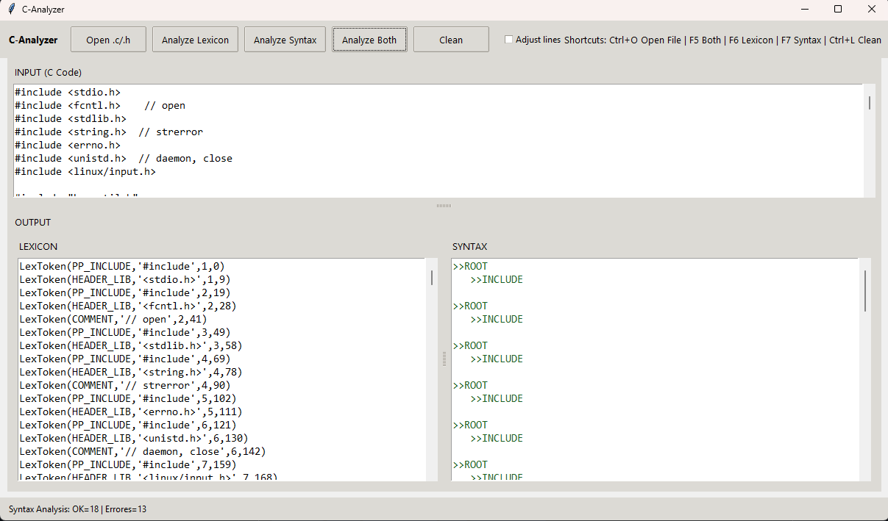

# C-analyzer — Lexical & Syntactic (subset) Analyzer for C

Desktop tool to **tokenize (lexical analysis)** and validate **syntactic structure (partial/subset)** of C code using **PLY (lex/yacc)** with a **Tkinter** GUI.

> Note: the syntax analysis targets a **subset** of the C language (declarations, expressions, control flow, etc.). Real-world C code may contain constructs not yet supported and may produce syntax errors (this is expected).

---

## ✨ Features

### ✅ Lexical Analysis (Tokens)
- Reserved keywords (if/else/switch/for/while, data types, storage classes, etc.)
- Arithmetic, relational, logical, and bitwise operators
- Literals: integers, decimals, char, string
- Preprocessor directives: `#include`, `#define`, `#undef`
- Headers with `<...>` and `"..."` (e.g., `#include <stdio.h>`, `#include "util.h"`)
- Comments: `//` and `/* ... */`

### ✅ Syntax Analysis (Parser — subset)
- Basic preprocessor directives (`#include`, `#define`, `#undef`)
- Control structures: `if/else`, `for`, `while`, `switch/case/default`
- Declarations and assignments (int/float/double/char)
- Math operations and comparisons
- Arrays (declaration/assignment in subset)
- Functions (declaration/calls in subset)

### 🖥️ GUI (Tkinter)
- Left panel: C code input
- Bottom-left: **lexical analyzer** output
- Bottom-right: **syntax analyzer** output
- Buttons: analyze lexicon / syntax / both / clear
- Recent improvements:
  - Strip trailing `// comments` before sending lines to the parser
  - Skip empty lines and some unsupported constructs (e.g., `typedef`, `static`) to reduce false positives

---

## 📦 Installation

### Requirements
- Python **3.10+** (recommended)
- Main dependency:
  - `ply`

> On Linux, if Tkinter is missing:
- Debian/Ubuntu: `sudo apt-get install python3-tk`
- Fedora: `sudo dnf install python3-tkinter`

### Install from the repository (recommended)
```bash
git clone https://github.com/dpaulsoria/c-analyzer.git
cd c-analyzer

python -m venv .venv
# Windows:
.venv\Scripts\activate
# Linux/Mac:
source .venv/bin/activate

python -m pip install -U pip
pip install -e .
```

### Install with development extras
```bash
pip install -e ".[dev]"
```

---

## ▶️ Run

### Option 1 (recommended)
```bash
python -m ui.app
```

### Option 2
```bash
python ui/app.py
```

---

## 🧠 How to use
1. Paste your C code into **INPUT**
2. Click:
   - **Analyze Lexicon** to see tokens
   - **Analyze Syntax** to validate structure (subset)
   - **Analize both** to run both analyzers
3. Review results:
   - **Lexicon Analyzer** prints `LexToken(...)`
   - **Syntax Analyzer** prints a tree-like output or `Syntax error...`

---

## 📁 Project structure

```
c-analyzer/
├─ ui/
│  ├─ __init__.py
│  └─ app.py                # (was screen.py) main GUI
├─ analyzers/
│  ├─ __init__.py
│  ├─ lexicon.py            # Lexer (PLY)
│  └─ syntax.py             # Parser (PLY)
├─ assets/                  # Resources (if any)
├─ pyproject.toml           # Modern packaging/install config
└─ README.md
```

---

## 🧩 Important technical notes

### 1) About `#include "file.h"`
The lexer treats quoted includes as valid headers (e.g., `"util.h"`).  
This avoids tokenizing `#include "util.h"` as a generic `STRING` in contexts where you want it treated like a header.

### 2) Strings and format specifiers
Strings like `"%s"` can be recognized as **format specifiers** (FS_STRING, etc.) when applicable.

### 3) Expected parser limitations
Real C code may include:
- prototypes with `static`, `typedef`, complex pointers
- advanced structs/unions
- complex macros
- multi-line declarations and flexible formatting

If your goal is to validate full C, you’ll need to extend the grammar in `analyzers/syntax.py`.

---

## 🛠️ Troubleshooting

### “Syntax error in input LexToken(COMMENT, ...)”
The subset grammar doesn’t integrate comments everywhere.
Applied fix in the GUI: it strips trailing `// ...` before parsing each line.

### Install error: “Multiple top-level packages discovered”
Solved by making packaging explicit in `pyproject.toml` and adding `__init__.py` so directories are proper Python packages.

---

## 🚀 Roadmap (ideas)
- Better handling for prototypes: `static`, `typedef`, pointers, and `struct`
- Block-based parsing `{ ... }` (not only line-by-line)
- Better visual feedback: highlight invalid token / exact line
- Export results to `.txt` or `.json`
- A cleaner tree/AST view

---

## 👥 Authors
- Paul Soria
- Gabriela Ramos
- Juan Xavier Pita

---

## 📷 Screenshots



